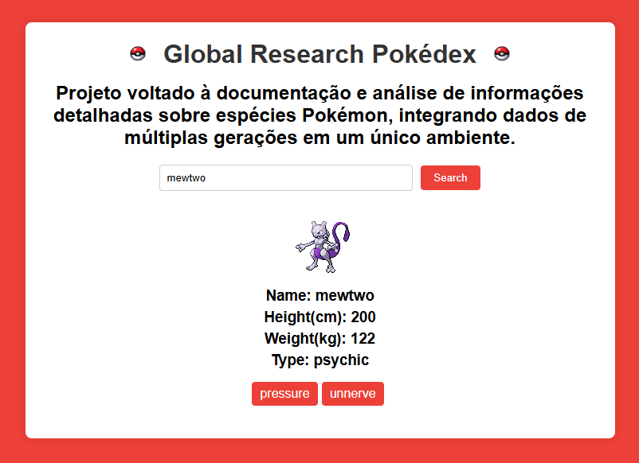

# 🌍 Global Research Pokédex

Aplicação web voltada à **documentação e análise de informações detalhadas sobre espécies Pokémon**, integrando dados de múltiplas gerações em um único ambiente por meio do consumo da **PokéAPI**.

O projeto tem como foco a **integração com APIs REST**, manipulação de dados e organização da lógica em JavaScript.

---

## 🖼️ Preview do Projeto



> Interface principal da aplicação exibindo informações detalhadas de um Pokémon pesquisado.

---

## 🚀 Funcionalidades

- Busca de Pokémon por nome
- Consumo de API REST (PokéAPI)
- Exibição dinâmica de:
  - Nome
  - Altura (cm)
  - Peso (kg)
  - Tipo(s)
  - Habilidades
- Tratamento de erros para Pokémon inexistentes
- Interface simples e objetiva

---

## 🧠 Tecnologias Utilizadas

- HTML5
- CSS3
- JavaScript (ES6+)
- Fetch API
- PokéAPI

---

## 📁 Estrutura do Projeto

```bash
api-pokemon/
│
├── index.html
├── style.css
├── script.js
├── pokebola.png
├── pokedex.png
└── README.md
````

## 🔌 API Utilizada

PokéAPI
https://pokeapi.co/

## 🎯 Objetivo do Projeto

Este projeto foi desenvolvido com o objetivo de:
- Praticar o consumo de APIs REST
- Trabalhar com requisições HTTP e JSON
- Consolidar fundamentos de JavaScript aplicado
- Servir como projeto de portfólio

## 👤 Autor

Antony Severo
Estudante de Análise de Sistemas e entusiasta da tecnologia.
